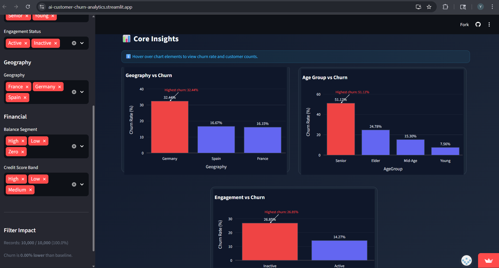
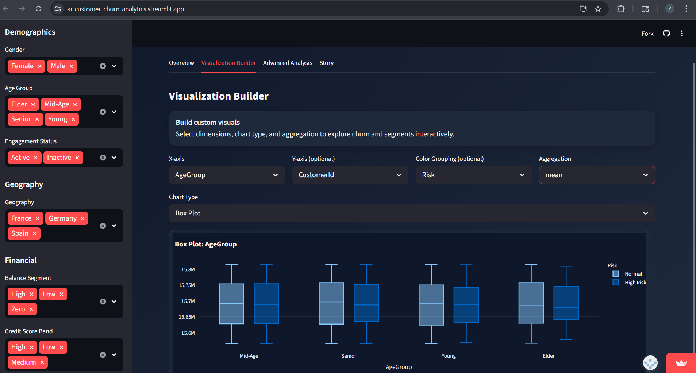
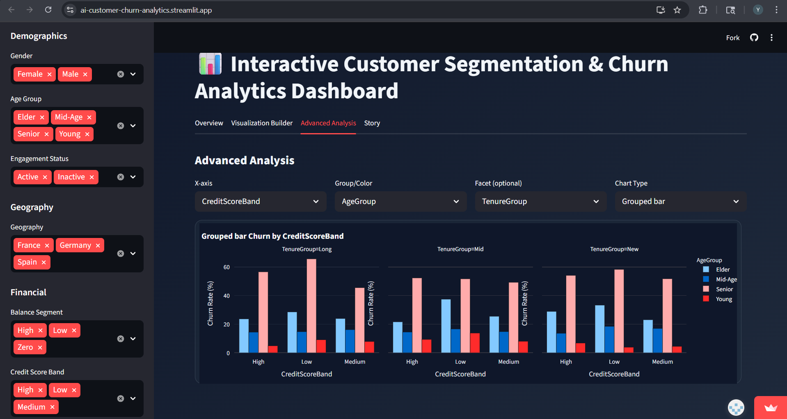

# 📊 AI-CUSTOMER-CHURN-ANALYTICS

🔗 **Live App:** https://ai-customer-churn-analytics.streamlit.app/

---

## 🚀 Overview

An interactive analytics dashboard for exploring customer churn patterns using segmentation, KPIs, and dynamic filtering. The application enables users to uncover insights across multiple customer dimensions and supports data-driven decision-making for retention strategies.

---

## ✨ Features

* Multi-dimensional customer segmentation (Geography, Age, Balance, Gender, Engagement, Credit Score, Tenure)
* Interactive filters for real-time analysis
* KPI tracking (overall churn rate & high-value customer churn)
* Dynamic visualizations across key customer segments
* Clean and responsive dashboard UI

---

## 🛠 Tech Stack

* Python
* Streamlit (dashboard framework)
* Pandas & NumPy (data processing & feature engineering)
* Plotly (interactive visualizations)
* Google Sheets (data source integration)

---

## 📊 Key Insights

* Identify high-risk customer segments using multi-dimensional analysis (demographics, activity, and financial attributes)
* Compare churn behavior across regions and customer demographics
* Analyze how customer activity and account balance influence churn probability
* Detect high-value customers at risk to support targeted retention strategies

---

## 🤖 AI Assistance

This project was built using AI-assisted development tools such as Cursor and ChatGPT for:

* Code structuring and modular design
* Feature engineering and segmentation logic
* UI/UX improvements and dashboard enhancements

---

## ▶️ Run Locally

```bash
pip install -r requirements.txt
streamlit run app.py
```

---

## 📸 Screenshots

Overview  


Overview 2  


Visualization Builder  


Advanced Analysis  


Story / Summary / Recommendation  

---

## 📬 Author

**Yashvi Chunilal Vaghela**

B.Tech – Artificial Intelligence & Data Science

📧 Email: [yashvi.cv@gmail.com]

🔗 LinkedIn: https://linkedin.com/in/yashvi-vaghela-639374307

🔗 GitHub: https://github.com/yashvivaghela04
